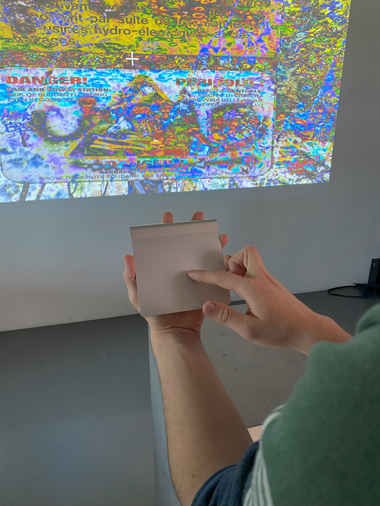
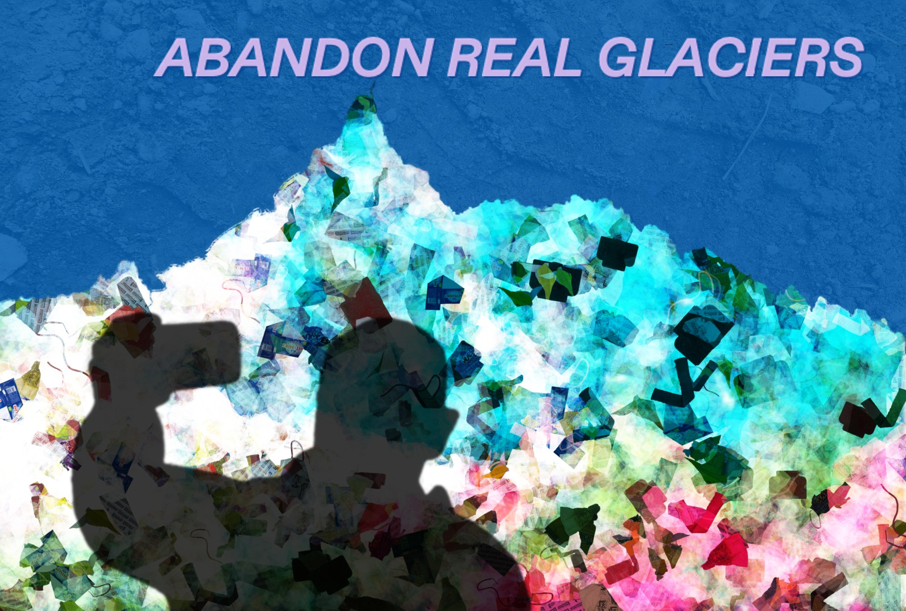

# 2023 09 md1_alpine-glacier | RENDU

-----
## Groupe 1 / UNNOTICED - Adam Cloud, Lauren Thiel, Enzo Seurre 
[UNNOTICED](UNNOTICED/)

Unnoticed is a project focused on the unseen. During our explorations in Chamonix, France, we gathered various types of data related to our interests. This includes audio recordings of radio waves, photographs of warning signs from all over Chamonix, and close-up images of details from rocks, moss, pavement, and insects.

Our initial concept was to create an unconventional map. We delved into how contemporary artists approach mapping and aimed to chart elements typically absent from traditional maps. In the creative coding aspect, we explored ways to make our map interactive and immersive. As the background, we utilised an approximate 3D terrain rendering from Google Maps, which possessed an intriguing style while effectively representing the terrain.

To engage with our project, you can use a wireless trackpad to adjust your position on the map. While navigating our map, you will hear sounds that indicate the locations of points of interest. These points remain invisible, but as you approach them, the sound amplifies until it unveils a composite scene: a picture of a warning sign superimposed with close-up texture details. This creates a surprising and somewhat alarming atmosphere. Once you move past these points, the sound volume decreases, allowing you to continue your map exploration at ease.

-----
## Groupe 2 / Burning Mule In The Mordor - Basile Brun, Naomi Blidariu, Mathis Baltisberger
[Burning Mule In The Mordor](BurningMuleInTheMordor/)

Burning Mule in the Mordor est un projet de creative coding s’inscrivant dans les mythes et
légendes qui planent au fin fond des glaciers de Chamonix.
Nous nous sommes réappropriés les contes fantastiques qui ont mutés à travers les siècles
en l’interprétant dans le folklore des creepy pasta; des légendes modernes alimentées par
l’imaginaire collectif des internautes.
Dans ce projet, nous sommes plongés dans le noir et observons par le biais d’un rayon
lumineux les ondes que portent la montagne. Le but étant de repérer des fréquences
inhabituelles au cœur du glacier provenant de silhouettes non identifiables.

- Navigation :  
glisser le curseur pour déplacer le halo à travers la scène
maintenir le clic gauche pour zoomer dans l’image

-----
## Groupe 3 / On dirait une carte postale - Katya Bliznyuk, Dasha Kotova, Jasmine Molano
[On dirait une carte postale](OnDiraitUneCartePostale/)

Chamonix, born from the Alpine culture around Mont Blanc, exists as a living postcard thriving through tourism. The aim of the project is to reflect on the metamorphosis of Chamonix, where natural beauty has fallen victim to man's desire for consumption and exploitation. Using our findings in the area, we aim to create a future image of Chamonix in the form of a postcard.

Each postcard consists of four layers. The first layer is the sky made of artificial textures that we found or observed in Chamonix. The second layer comprises mountain outlines taken from real postcards bought in local souvenir shops. These mountains are reconstructed with trash samples collected on the hiking paths. The third layer shows figures of tourists taking selfies, thus emphasizing the idea of a shift in values, where it is now more important to "mark" being in a place as opposed to actually enjoying its beauty. The last layer consists of text made from randomly selected words from interviews with locals and tourists in Chamonix, who had contrasting views on the current situation in the region. Each layer is randomly generated and can be changed with a separate keyboard key.

-----
## Groupe 4 / Mathilde Schibler, Océane Serrat
[Delusional Souvenirs](DelusionalSouvenirs/)

texte

-----
## Groupe 5 / Spiritual Flags - Leyla Benkais, Sarah Meylan
[Spiritual Flags](SpiritualFlags/)

Ce projet s’inspire des drapeaux de prières Tibétains. Considérés comme des porte-bonheurs, ils auraient la capacité d’écarter les difficultés et apaiseraient les dieux et les esprits des montages, des vallées, des lacs et des ruisseaux.

Voulant démontrer l’impact des infrastructures sur la nature de Chamonix ainsi que de leur cohabitation, un système graphique flexible a été généré grâce aux DATAS récupérées sur 7 places précise de Chamonix. (Mer de glace/ Place du village/ Téléphérique/ Fête foraine/ Cimetière/ Forêt/ Rivière).

4 DATAS sont représentées graphiquement pour qu’une fois réunies, le drapeau du lieu en question se créé.
Les Ondes Électroniques génèrent les colonnes, l’image la palette de couleurs, l’audio les vagues du centre et la localisation le point.

Placé sous forme d’autel, une stèle se trouve en face de l’écran pour nous permettre de choisir 1 des 3 offrandes mises à disposition pour activer le drapeau qui leur est reliées. Le smartphone représente la Mer de glace du au nombreux selfies pris par les touristes sur place, la carte de credit représente la Place du village du aux nombreux magasins, bar et restaurants, le micro quand à lui représente le téléphérique du aux annonces passées à travers lui durant la journée.

-----